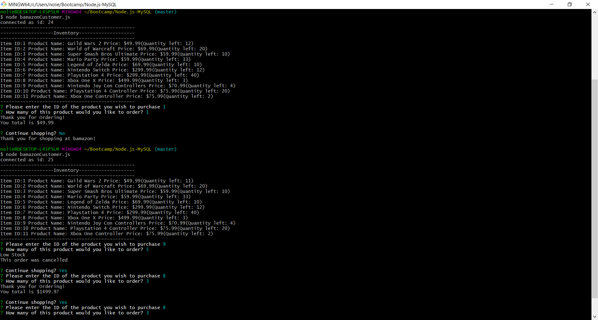
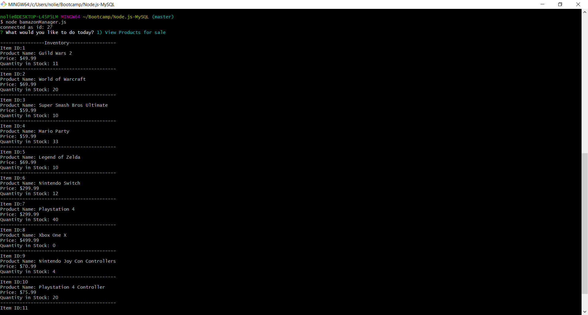
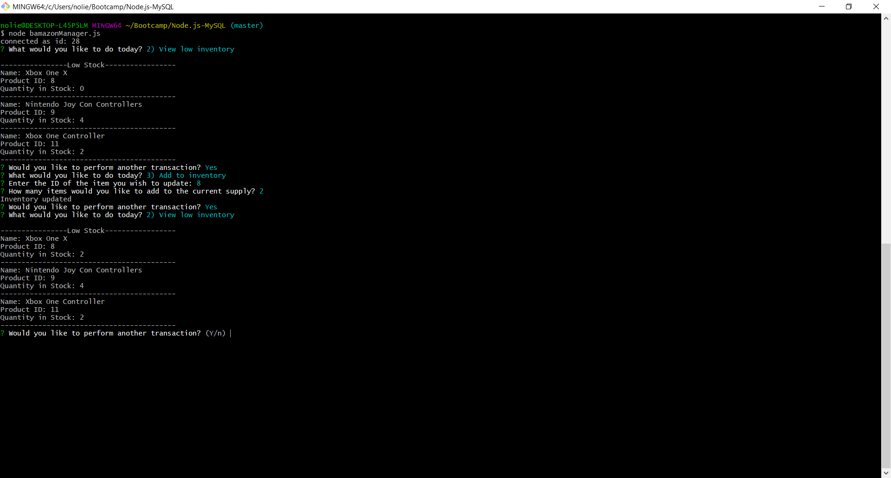
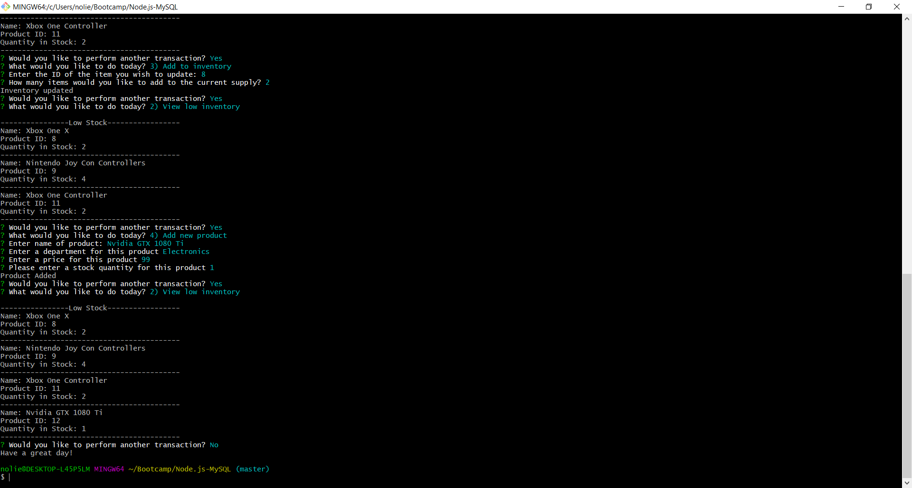
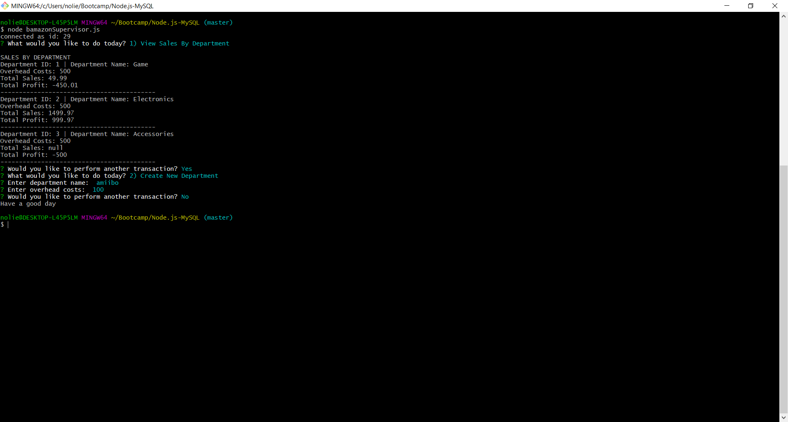

# Node.js-MySQL - bamazon store - we sell everything from b to z! 

## An Interactive Command Line Node application.

# For Customers:

## bamazonCustomer.js allows customers to buy a listed item. The quantity is checked against the inventory from the database and a total is sent to a separate table to track the department's profitability.

# For Managers:

## bamazonManager.js allows managers to view available items, view low stock of less than 5, add to the inventory, and or add a new product.

# For Supervisors:

## bamazonSupervisor.js allows Supervisors to view sales by department or add a new department. 

